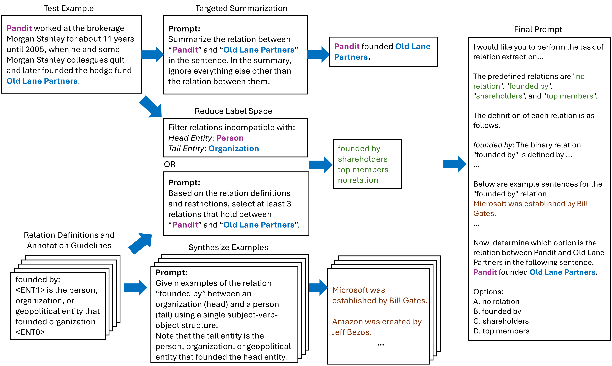

# Relation-Aware Prompting
Code and data for the paper "Relation-Aware Prompting Makes Large Language Models Effective Zero-shot Relation Extractors"
https://aclanthology.org/2025.starsem-1.22/



## Abstract
While supervised relation extraction (RE) models have considerably advanced the state-of-the-art, they often perform poorly in low-resource settings. Zero-shot RE is vital when annotations are not available either due to costs or time constraints. As a result, zero-shot RE has garnered interest in the research community. With the advent of large language models (LLMs) many approaches have been proposed for prompting LLMs for RE, but these methods often either rely on an accompanying small language model (e.g., for finetuning on synthetic data generated by LLMs) or require complex post-prompt processing. In this paper, we propose an effective prompt-based method that does not require any additional resources. Instead, we use an LLM to perform a two-step process. In the first step, we perform a targeted summarization of the text with respect to the underlying relation, reduce the applicable label space, and synthesize examples. Then, we combine the products of these processes with other elements into a final prompt. We evaluate our approach with various LLMs on four real-world RE datasets. Our evaluation shows that our method outperforms the previous state-of-the-art zero-shot methods by a large margin. This work can also be considered as a new strong baseline for zero-shot RE that is compatible with any LLM.

## Running the Experiments in the Paper
The `evaluation` directory contains subdirectories for the experiments on each dataset. For each dataset, several proprietary and open-source LLMs were used for the experiments.

### Running the OpenAI Models
Run the script called `run_eval_{dataset_name}_openai.py` where *dataset_name* is the name of the dataset. So for example for TACRED, run `run_eval_tacred_openai.py`.

Note:
- To provide the OpenAI API key, open the file in a text editor and update the variable `api_key` by assigning your key to the variable.
- To choose the OpenAI model, update the `model` variable to either `gpt-4.1-2025-04-14` or `gpt-4o-mini-2024-07-18`.
- Then simply run the script: `python run_eval_tacred_openai.py`

### Running the Open-source Models
We used Hugging Face inference providers to run `Llama-3.1-70B-Instruct` and `gemma-3-27b-it` experiments. For `mistral-large-2411`, we used the inference providers from Mistral. However, if you prefer to run these models locally on your own machines and using your own GPUs, it is also possible and we provide the means for that.

#### Running the Hugging Face Inference Providers
To run `Llama-3.1-70B-Instruct` and `gemma-3-27b-it` experiments, we used `run_eval_{dataset_name}_opensource_api.py` where *dataset_name* is the name of the dataset. So for example for TACRED, run `run_eval_tacred_opensource_api.py`.

Note:
- To provide the Hugging Face token, open the file in a text editor and update the variable `token` by assigning your token to the variable.
- To choose the model, update the `model` variable to either `meta-llama/Llama-3.1-70B-Instruct` or `google/gemma-3-27b-it`.
- You also need to choose the Hugging Face inference provider. These providers run models on the cloud and charge you based on usage. Different providers have different rates. Each model may have different providers, and the available providers for a model may change over time. To choose a provider, update the `provider` variable. Currently, it is set to the value `auto` which means the first provider available for the model will be automatically selected.
- Then simply run the script: `python run_eval_tacred_opensource_api.py`

#### Running the Mistral Inference Provider
To run `mistral-large-2411`, we used the provider from [Mistral](https://mistral.ai/pricing/api/). We ran `run_eval_{dataset_name}_mistral_api.py` where *dataset_name* is the name of the dataset. So for example for TACRED, run `run_eval_tacred_mistral_api.py`.

Note:
- To provide your mistral.ai API key, open the file in a text editor and update the variable `api_key` by assigning your key to the variable.
- Then simply run the script: `python run_eval_tacred_mistral_api.py`

#### Running the Open-source Models Locally on Your Own Machines and GPUs
For each dataset, we provide a file called `run_eval_{dataset_name}_opensource.py` (e.g. `run_eval_tacred_opensource.py`) where you can run an open-source model locally using Hugging Face `transformers`.

Note:
- We did not use this method for our experiments. As mentioned before, we used cloud providers to run our experiments instead of running them locally.
- To provide the Hugging Face token, open the file in a text editor and update the variable `token` by assigning your token to the variable.
- To choose the model, update the `model` variable to your model of choosing, e.g. `meta-llama/Llama-3.1-8B-Instruct`, `google/gemma-2-9b-it`, etc.
- Always set the `model_family` variable to `Model_Family.OPEN_SOURCE` unless the model is `meta-llama/Llama-3.1-8B-Instruct`. Due to some issues with the model, we created a special model family for it `Model_Family.LLAMA_31_8B`.
- Use `AutoModelForCausalLM` and `AutoTokenizer` to load your model and its tokenizer. Each models has its own special settings and nuances that you need to take care of, such as tokenizer's `padding_side`, `pad_token`, etc.
- Then simply run the script: `python run_eval_tacred_opensource.py`

### Note about Synthesizing Examples
As part of our approach, we generate synthesized examples (to be used as demonstrations in prompts). Since we have already run the experiments, these synthesized examples are already present in `json` subdirectories in the `evaluation` subdirectories. Therefore, the experiments scripts don't re-generate these synthesized examples when run. If you would like to re-generate the synthesized examples, there is a variable called `synthesize_examples` in all experiments scripts that is set to `False`. If you would like to re-generate the synthesized examples, set it to `True`.

## Citation
If you use this work in your research, please cite our paper:

```bibtex
@inproceedings{rahimi-etal-2025-relation,
    title = "Relation-Aware Prompting Makes Large Language Models Effective Zero-shot Relation Extractors",
    author = "Rahimi, Mahdi and Dumitru, Razvan-Gabriel and Surdeanu, Mihai",
    booktitle = "Proceedings of the 14th Joint Conference on Lexical and Computational Semantics (*SEM 2025)",
    year = "2025",
    publisher = "Association for Computational Linguistics",
    url = "https://aclanthology.org/2025.starsem-1.22/",
    doi = "10.18653/v1/2025.starsem-1.22",
    pages = "280--292",
}
```
